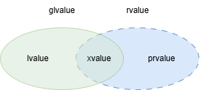

# Rvalue reference
[lvalue and rvalue in C language](https://www.geeksforgeeks.org/lvalue-and-rvalue-in-c-language/)

## Left value
如果能對表達式取地址 `&`，則它便是 lvalue，常見的有這幾種
1. 變數名稱: 任何型態的變數名稱
```
int x = 10;   // x 是 lvalue
char y = 'a'; // y 是 lvalue
```
2. 回傳 lvalue reference (T&) 的函式呼叫
```
vector<int> v;
v.emplace_back(5);
v[0] = 10; // v[0] 是 lvalue
```
3. 對指針解引用的結果 `(*ptr)`
```
int a = 50;
int* ptr = &a;
*ptr = 100; // *ptr 是 lvalue
```
4. 存取物件 / 陣列成員 / 元素的結果
```
int arr[5];
arr[0] = 10; // arr[0] 是 lvalue

struct Point {int x;};
Point pt;
pt.x = 7; // pt.x 是 lvalue
```
5. 轉型為 lvalue reference
```
int x = 10;
static_cast<int&>(x) = 20; // 轉型結果是 lvalue
```
6. 字串常值 (string literal)
```
const char* p = "hello world!"; // "hello world!" 是 lvalue
```
## Pure right value (prvalue)
用來**初始化一個物件**或**計算一個運算元的值**的表達式，不能對它取地址 `&`
```
int a = 3;
int b = 1;
int c;

c = 6;     // 6 是 prvalue
c = a + b; // a + b 是 prvalue
```
```
struct S{};
S obj;
obj = S{}; // S{} 是臨時物件的初始化表達式，這個臨時物件 S{} 是 prvalue

S func()
{
    return S{};
}

obj = func(); // func() 回傳的結果 (T) 是 prvalue
```
* `this` 與 `lambda expression` 也是 prvalue

## Examples
```
void func1(int& a)
{
    cout << "lv ref" << endl;
}

void func1(int&& a)
{
    cout << "rv ref" << endl;
}

func1(a);
func1(6);
```
```
lv ref
rv ref
```
```
class CharBuffer
{
public:
    CharBuffer(size_t n_size): m_buff(new char[n_size]), m_size(n_size)
    {
        cout << "base constructor" << endl;
    }
    CharBuffer(const CharBuffer& other): m_buff(new char[other.m_size]), m_size(other.m_size)
    {
        cout << "copy constructor" << endl;
        memcpy(m_buff, other.m_buff, m_size);
    }
    CharBuffer& operator=(const CharBuffer& other)
    {
        if (this == &other)
        {
            return *this;
        }
        delete [] m_buff;
        m_size = other.m_size;
        m_buff = new char[m_size];

        memcpy(m_buff, other.m_buff, m_size);

        cout << "copy assignment operator" << endl;

        return *this;
    }
    CharBuffer(CharBuffer&& other): m_buff(other.m_buff), m_size(other.m_size)
    {
        other.m_buff = nullptr;
        other.m_size = 0;
        cout << "move constructor" << endl;
    }
    CharBuffer& operator=(CharBuffer&& other)
    {
        if (this == &other)
        {
            return *this;
        }

        delete [] m_buff;
        m_buff = other.m_buff;
        m_size = other.m_size;

        other.m_buff = nullptr;
        other.m_size = 0;

        cout << "copy assignment operator" << endl;
        
        return *this;
    }
    ~CharBuffer()
    {
        delete [] m_buff;
        m_buff = nullptr;
        cout << "destructor" << endl;
    }

private:
    char* m_buff;
    size_t m_size;
};


CharBuffer generate(size_t n)
{
    return CharBuffer(n);
}

CharBuffer generate_nv(size_t n)
{
    CharBuffer buf(n);
    cout << &buf << endl;
    return buf;
}
```
* `CharBuffer buf1{CharBuffer(100)};` 完整的步驟會先調用 `base constructor` 後，再透過 `move constructor` 給 `buf1`，但編譯器會透過 copy elision (複製省略) 來避免創建一個臨時對象的開銷
```
CharBuffer buf1{CharBuffer(100)};
```
```
base constructor
destructor
```
* `CharBuffer buf2 = generate(100);` 程式不會調用 `move constructor`，此技術叫 return value optimization (RVO)
```
CharBuffer buf2 = generate(100);    // return value optimization (RVO)
```
```
base constructor
destructor
```
* `CharBuffer buf3 = generate_nv(100);` 在離開 `generate_nv()` 後，不會調用 destructor，而是直接將創建的物件 `buf` 給 `buf3`，此技術叫 named return value optimization (NRVO)
```
CharBuffer buf3 = generate_nv(100); // named return value optimization (NRVO)
cout << &buf3 << endl;
```
```
base constructor
0x7fff689bef70
0x7fff689bef70
destructor
```
## std::move
`move()` 將一個 lvalue 轉換為 xvalue，意思上與 `static_cast<T&&>(__t)` 相同
* push_back 對於 rvalue 的方法是 `emplace_back(move(__x))`
```
vec.push_back(CharBuffer(100));
```
```
base constructor
move constructor
destructor
```
* emplace_back(T&&) 沒有涉及 move semantic，因此只有 base constructor
```
vec.emplace_back(100);
```
```
base constructor
```
* `assign(move(buf1), buf2)` 是 copy assignment operator 而非 move assignment，因為 move(buf1) 在 main 是 rvalue，進入 assign() 變成 lvaule，因此會調用 copy assignment
```
CharBuffer& assign(CharBuffer&& src, CharBuffer& dst)
{
    dst = src;
    return dst;
}

assign(move(buf1), buf2);
```
```
copy assignment operator
```
## std::forward
透過 `forward<T>()` 可以保留它原始的 value category (值類別)
引用的右值變成左值的問題，便能夠透過 `forward<T>()` 將它變回右值
```
void func1(int& a)
{
    cout << "lv ref" << endl;
}

void func1(int&& a)
{
    cout << "rv ref" << endl;
}

template<typename T>
void func2(T&& a)
{
    func1(forward<T>(a));
}

func2(4);
func2(a);
```
```
rv ref
lv ref
```
右值引用的 `func2` 與 `forward` 實例化如下，因此 a 進入 `func1` 仍為 rvalue
```
void func2<int>(int&& a)
{
    func1(forward<int>(a));
}

int&& forward<int>(int& t) noexcept
{
    return static_cast<int&&>(t);
}
```
左值引用的 `func2` 與 `forward` 實例化如下，根據引用折疊 (reference collapsing) 的規則，`int& &&` 會變成 `int&`，因此 a 進入 `func1` 仍為 lvalue
```
// void func2<int&>(int& && a)
void func2<int&>(int& a)
{
    func1(forward<int&>(a));
}

int& && forward(int& t) noexcept
{
    // return static_cast<int& &&>(t);
    return static_cast<int&>(t);
}
```
## reference collapsing
|before|after|
|:-:|:-:|
|T& &|T&|
|T& &&|T&|
|T&& &|T&|
|T&& &&|T&&|