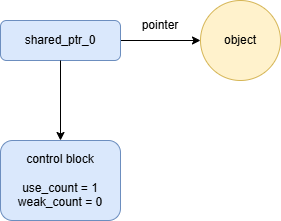
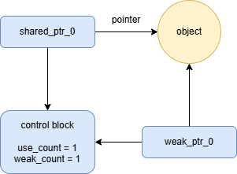
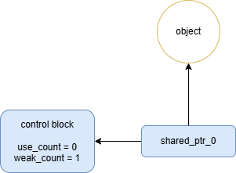
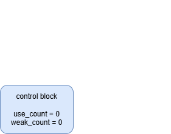

# Unique pointer
`unique_ptr` class template
```
template<class T, class Deleter = std::default_delete<T>>
class unique_ptr;
```
`unique_ptr` 不能將不同指標指向同個物件
```
class linear_line
{
private:
    float a_;
    float b_;
public:
    linear_line(float a, float b): a_(a), b_(b) {}
    ~linear_line()
    {
        cout << "~linear_line()" << endl;
    }
    float output_y(float x)
    {
        return a_ * x + b_;
    }
};

unique_ptr<linear_line> u_ptr_0(new linear_line(2.0, 3.0));
unique_ptr<linear_line> u_ptr_1 = u_ptr_0;
```
```
error: use of deleted function ‘std::unique_ptr<_Tp, _Dp>::unique_ptr(const std::unique_ptr<_Tp, _Dp>&) [with _Tp = linear_line; _Dp = std::default_delete<linear_line>]’
   25 |         unique_ptr<linear_line> u_ptr_1 = u_ptr_0;
      |                                           ^~~~~~~
```
創建 `unique_ptr`
```
unique_ptr<linear_line> u_ptr_0(new linear_line(2.0, 3.0));
unique_ptr<linear_line> u_ptr_1 = make_unique<linear_line>(3.0, 4.0);
```
與一般指標相同，使用 `operator->` 使用 class function 或 member
```
cout << u_ptr_0->output_y(5.0) << endl;
cout << u_ptr_1->output_y(5.0) << endl;
```
```
13
19
```
`unique_ptr` 會自動管理指標
```
~linear_line()
~linear_line()
```
這些操作會刪除原本管理的物件
1. `std::move`
2. point to `nullptr`
3. reset `unique_ptr`
```
unique_ptr<linear_line> u_ptr_2(new linear_line(2.0, 3.0));
unique_ptr<linear_line> u_ptr_3(new linear_line(2.0, 3.0));
unique_ptr<linear_line> u_ptr_4(new linear_line(2.0, 3.0));
// std::move
u_ptr_2 = move(u_ptr_0);
// point to nullptr
u_ptr_3 = nullptr;
// unique_ptr.reset，先刪除原本的指標，再創建新的物件
u_ptr_4.reset(new linear_line(2.0, 3.0));
```
若想排序物件，通常有複製的開銷，但指標只需要複製地址，能大幅減少複製的開銷
只需要微小的性能損失，`unique_ptr` 便能自動管理記憶體，讓程式更加安全
```
struct package
{
    int m_id;
    char data[1000];
    package(int id): m_id(id) {}
};

struct compare
{
    bool operator()(const package& a, const package& b)
    {
        return a.m_id > b.m_id;
    }
    bool operator()(const unique_ptr<package>& a, const unique_ptr<package>& b)
    {
        return a->m_id > b->m_id;
    }
    bool operator()(const package* a, const package* b)
    {
        return a->m_id > b->m_id;
    }
};

vector<int> vec_id;
for (int i = 0; i < 10000; i++)
{
    vec_id.emplace_back(rand() % 100000);
}
```
## normal method
```
vector<package> vec_packages;
for (int i = 0; i < 10000; i++)
{
    vec_packages.emplace_back(package(vec_id[i]));
}

// sort vector
sort(vec_packages.begin(), vec_packages.end(), compare());
```
## unique_ptr
```
vector<unique_ptr<package>> vec_u_ptr_packages;
for (int i = 0; i < 10000; i++)
{
    vec_u_ptr_packages.emplace_back(unique_ptr<package>(new package(vec_id[i])));
}

// sort vector
sort(vec_u_ptr_packages.begin(), vec_u_ptr_packages.end(), compare());
```
## normal pointer
```
vector<package*> vec_ptr_packages;
for (int i = 0; i < 10000; i++)
{
    vec_ptr_packages.emplace_back(new package(vec_id[i]));
}

// sort vector
sort(vec_ptr_packages.begin(), vec_ptr_packages.end(), compare());
```
## Execution time table (with -O2 argument)
||normal method (µs)|unique_ptr (µs)|normal指標(µs)|
|:-:|:-:|:-:|:-:|
|1|5465|573|620|
|2|5280|643|594|
|3|5580|667|586|
|4|5409|584|596|
|5|5009|604|612|
# Shared pointer
相較於 `unique_ptr`, `shared_ptr` 可以指向同個物件

`use_count()` 用來記錄有多少個指標指向同個物件

`unique()` 可以確定該指標是否是唯一的指標指向某個物件
```
shared_ptr<linear_line> s_ptr_0(new linear_line(2.0, 3.0));
shared_ptr<linear_line> s_ptr_1 = s_ptr_0;
shared_ptr<linear_line> s_ptr_2(s_ptr_0);

cout << s_ptr_0.use_count() << endl;
cout << s_ptr_0.unique() << endl;
```
```
3
0
```
`shared_ptr` 支援 `dynamic_pointer_cast`、`static_pointer_cast` 以及 `const_pointer_cast`
```
class base
{
public:
    virtual ~base() {}
};

class derive:public base
{

};

shared_ptr<base> s_ptr_3(new derive());
shared_ptr<derive> s_ptr_4 = dynamic_pointer_cast<derive>(s_ptr_3);
shared_ptr<base> s_ptr_5 = static_pointer_cast<base>(s_ptr_4);

cout << s_ptr_3.use_count() << endl;
```
```
3
```
當使用 `shared_ptr` 時，應避免迴圈引用，會造成記憶體洩漏
因為 `person._partner.use_count()` 不為 0，因此該物件不能被刪除
```
class person
{
public:
    person(const string& name): _name(name)
    {
        cout << _name << " person()" << endl;
    }
    ~person()
    {
        cout << _name << " ~person()" << endl;
    }
    void set_partner(const shared_ptr<person>& other)
    {
        _partner = other;
    }
private:
    string _name;
    shared_ptr<person> _partner;
};

vector<shared_ptr<person>> vec_person;
vec_person.emplace_back(shared_ptr<person>(new person("ABC")));
vec_person.emplace_back(shared_ptr<person>(new person("DEF")));
vec_person.emplace_back(shared_ptr<person>(new person("GHI")));

vec_person[0]->set_partner(vec_person[1]);
vec_person[1]->set_partner(vec_person[2]);
vec_person[2]->set_partner(vec_person[0]);
```
```
ABC person()
DEF person()
GHI person()
```
將 `shared_ptr<person> _partner` 替換成 `weak_ptr<person> _partner`
```
ABC person()
DEF person()
GHI person()
ABC ~person()
DEF ~person()
GHI ~person()
```
`weak_ptr.lock()` 用途
1. 存取有效的 `shared_ptr`
2. 檢查物件是有有效，，如果 `weak_ptr.lock()` 回傳 `nullptr`，代表被 `weak_ptr` 指向的物件已被刪除
3. 為避免競爭條件，control block 中的 counter 是原子化的
```
weak_ptr<base> w_ptr_0;
{
    shared_ptr<base> s_ptr_6(new base());
    shared_ptr<base> s_ptr_7 = s_ptr_6;
    w_ptr_0 = s_ptr_6;
    shared_ptr<base> s_ptr_8 = w_ptr_0.lock();

    cout << "in scope: " << s_ptr_8 << endl;
}
shared_ptr<base> s_ptr_8 = w_ptr_0.lock();
cout << "out scope: " << s_ptr_8 << endl;
```
```
in scope: 0x55da7079e4e0
out scope: 0
```
1. 創建 `shared_ptr` (use_count +1)<br>
2. 創建 `weak_ptr` (weak_count +1)<br>如果 use_count > 0, 代表物件存在，並且`weak_ptr` 可以觀察物件<br>
3. 刪除 `shared_ptr` (use_count -1)<br>當離開 scope 後，`shared_ptr` 就會被銷毀，如果 `use_count = 0`，那 `shared_ptr` 便會刪除管理的物件<br>
4. 刪除 `weak_ptr` (weak_count -1)<br>當離開 scope 後，`weak_ptr` 以及 `control block` 被刪除<br>